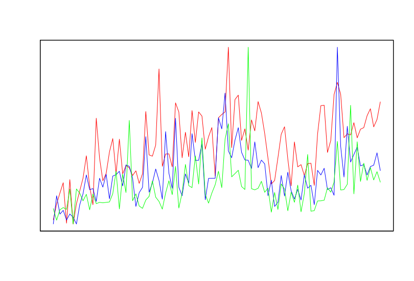

# Equation Estimation using Genetic Algorithm

### *Problem Definition*

*The goal of this assignment is to solve a simple mathematical game using **genetic algorithms** (examples are given in R). In this game, you are given a set of numbers, a set of mathematical operators, and a target number. Your goal is to arrange the numbers and mathematical operators in such a way that the result of the equation comes as close to the target number as possible. For example:*

- *You are given the numbers 10,25,100,5,3 and operators +, −, /, ∗*
- *The target number is 2512*

*A solution that matches the target number would be 100 ∗25 + 10 + 5 −3 = 2512. Depending on the set of numbers, reaching the target number may not always be possible. To make the problem slightly easier, the following rules also apply:*

- *Each number can only be used once*
- *Each operator can be used multiple times*
- *Your solutions should not include brackets*

# 1. Population

Firstly, we have decided that we will represent our solution with permutations. Why? For example let's use numbers: *10, 25, 100, 5, 3* and operators: *+, -, /, *,* represented as a string vector:

`numbers_and_operators <- c("10", "25", "100", "5", "3", "+", "-", "/", "*")` 

Let's say that the number we want to get e.g. our target number is equal to `2512`. From looking long enough in our numbers and operators we can see one of many possible solutions is, for example: `100 * 25 + 10 + 5 - 3` equals our target number, which means that our solution could be a string vector: `result ← c("100", "*", "25", "+", "10", "+", "5", "-", "3")`

The problem is that this kind of vector will not work with GA library. Because of that, we will represent our solutions as indices of a string, for our example, the valid solution would look like:

`result ← c(3, 9, 2, 6, 1, 6, 4, 7, 5)`

If we want to get a string vector e.g. a solution that we can actually help ourselves with, we need to transform solution written as indices of a string into a more meaningful solution that can be more easily interpreted. We could do that with `solution <- numbers_and_operators[result]`

```r
########################## 1: POPULATION #######################################

# Function that accepts GA object and returns generated population
generate_population <- function(object) {
  # Get length of expression and size of population
  numbers_operators_length <- object@upper
  population_size <- object@popSize
  
  # Get number of numbers and operators
  operators_length <- numbers_operators_length %/% 2
  numbers_length <- numbers_operators_length - operators_length
  
  population <-
    matrix(nrow = population_size, ncol = numbers_operators_length)
  
  # Create population_size instances of generation
  for (instance in 1:population_size) {
    # Create permutation of numbers and operators
    numbers <-
      sample(x = 1:numbers_length,
             numbers_length,
             replace = FALSE)
    operators <-
      sample(
        x = (numbers_length + 1):numbers_operators_length,
        operators_length,
        replace = TRUE
      )
    
    # Create instance I (interweaving between numbers and operators)
    I <- c(1:numbers_operators_length)
    I[1:numbers_operators_length %% 2 == 1] = numbers
    I[1:numbers_operators_length %% 2 == 0] = operators
    
    population[instance,] <- I
  }
  
  return(population)
}

################################################################################
```

Function `generate_population` accepts `object` of class `GA` and returns randomly generated `population`. First, from the object given as a parameter in the function, we extract data on the number of numbers and operators (`numbers_operators_length`) and the size of the population e.g. how many instances the generation consists of (`population_size`). The next thing we do is calculate how many numbers (`numbers_length`) and how many operators (`operators_length`) we need to use in each instance of the generation. Since we know that the `numbers_length` must be exactly one more than the `operators_length`, this means that the `numbers_operators_length` is an odd number. If we know that, we can calculate the`operators_length` by dividing the `numbers_operators_length` by 2 and rounding the result down. Since we know that the sum of `operators_length` and `numbers_length` is equal to the `numbers_operators_length`, the `numbers_length` can be obtained by subtracting the number of operators from `numbers_operators_length`. When we calculate these two parameters, we can make a population that does not contain valid specimens. We do this by initializing a matrix that has as many columns as there are all numbers and operators (`numbers_operators_length`), and as many rows as there are instances to make for a given population (`population_size`). Now we can begin to randomly generate specimens of our `population`. Given that we decided to present the solution as a vector of indices of a string, and our input vector `numbers_and_operators` is composed so that first are the numbers and then the operators, we decided to present the numbers as a random vector of `numbers` from `1` all the way to the `numbers_length`, and `operators` as a random vector of numbers from the `numbers_lengt + 1` all the way to the `numbers_operators_length`. Due to the agreement on the presentation of the population specimen and the principles of mathematics, all our population specimens (`I`) will be composed so that the odd vector indices will represent the `numbers`, and the even indices will be the `operators`. For our example, this function should return something like that:

```r
    x1 x2 x3 x4 x5 x6 x7 x8 x9
I1   1  7  3  7  4  7  2  6  5
I2   2  7  4  6  5  8  1  9  3
I3   4  6  3  7  1  9  5  7  2
I4   3  9  2  6  1  6  4  7  5
```

# 2. Fitness function

Secondly, we have written a function that is used to optimize our problem. Since `ga()` algorithm can only maximize our solution, we want to represent good expressions as a large number comparing to the bad expressions, which are represented with a small number.

```r
########################## 2: FITNESS FUNCTION #################################

# Function that accepts mathematical expression and calculates result
fitness <- function(expression) {
  result <-
    eval(parse(text = paste(numbers_operators[expression], collapse = "")))
  
  # Return negative absolute value, because GA maximize results
  return(-abs(target_number - result))
}

###############################################################################
```

Function `fitness` accepts `expression`, which is basically a vector of indices of a string and calculates the fit value (`return value`) that represents, how good our expression is. The function first converts the index vector into the corresponding string vector (`numbers_operators[expression]`), which it then converts into a single string (`paste()`), which represents the expression we compute with the `eval()` function. The result obtained is then subtracted from the expected value and thus we get an estimate of how good our actual result is. As already mentioned, the `ga()` algorithm can only maximize it after a given estimate, so we calculate the `absolute value` of the obtained result and multiply it by `-1`. This way, good results, i.e. terms that are very close to the desired number, will be presented with a small negative number, and bad results will be presented with a large negative number. For our example, if function accepts `expression ← c(4, 6, 3, 7, 1, 9, 5, 7, 2)` that means that expression that needs to be solved is equal to `"5" "+" "100" "-" "10" "*" "3" "-" "25"` which is equal to `50`. Our fitness function should return `-2462`.

# 3. Crossover and mutation functions

Thirdly, since the crossover functions that come with the `GA` library are not well suited for this problem domain we wrote multiple different crossover and mutation functions, especially to get a valid population specimen and to compare results between them.

```r
########################## 3: CROSSOVER FUNCTION ###############################

# Function that accepts object and two parents and returns crossover children
# This crossover crossovers operators only from random cross point
crossover <- function(object, parents) {
  numbers_operators_length = object@upper
  operators_length <- numbers_operators_length %/% 2
  numbers_length <- numbers_operators_length - operators_length
  
  parent1 = object@population[parents[1], ]
  parent2 = object@population[parents[2], ]
  
  children = matrix(0, nrow = 2, ncol = numbers_operators_length)
  
  # Crossover point value
  crossover_point <- sample(1:operators_length, 1) * 2
  
  # Keep numbers and crossover operators
  children[1,] <- parent1
  children[2,] <- parent2
  for (
		i in seq(from = crossover_point, to = numbers_operators_length, by = 2)
	) {
    children[1, i] <- parent2[i]
    children[2, i] <- parent1[i]
  }
  
  return(list(children = children, fitness = rep(NA, 2)))
}

################################################################################
```

The `crossover` function performs a simple crossover that works by selecting a crossover point based on a random number. All the operators lying to the right of the selected crossing point are then intertwined in the children. The function first retrieves the number of all numbers and operators (`numbers_operators_length`) from the object and then calculates the number of all numbers (`numbers_length`) and the number of all operators (`operators_length`). An additional explanation is described above (first chapter). From the population obtained from the `object`, we can convert the index vector into a string vector and thus obtain two parents (`parent1`, `parent2`) over which we will perform a crossover. In the variable `crossover_point`, the random value of the operator index is stored, which represents the boundary from where we want to interlace all the parent operators. We do this by entering all the values of `parent1` in `child1` and all the values of `parent2` in `child2`. Then, from the point crossover (`crossover_point`), we replace all operators to `child1` with `parent2` and `child2` with `parent1`. The resulting `children` function returns in the format required for the proper operation of the `ga()` algorithm. For our example, if function accepts `parent1 ← c(4, 6, 3, 7, 1, 9, 5, 7, 2)`,

 `parent2 ← c(3, 9, 2, 6, 1, 6, 4, 7, 5)` and the `crossover_point` is equal to `4` that means that our function will return a matrix of children with swapped operators:

```r
children <- c(
	c(4, 6, 3, 6, 1, 6, 5, 7, 2),  # child1
	c(3, 9, 2, 7, 1, 9, 4, 7, 5),  # child2
)
```

---

```r
########################## 3: MUTATION FUNCTION ################################

# Function that accepts object and a parent and returns mutated child
# Mutate on operators, numbers, operators and numbers or don't mutate
mutation <- function(object, parent) {
  # Select a parent from the population
  mutate <- parent <- as.vector(object@population[parent, ])
  numbers_operators_length <- length(parent) %/% 2
  
  # Mutate on: none (1), number (2), operator (3) or number and operator (4)
  mutation_score <- sample(1:4, size = 1)
  
  if (mutation_score == 2) {
    # Mutate on numbers (swap two numbers)
    m <- sample(0:numbers_operators_length, 2) * 2 + 1
    mutate[m[1]] <- parent[m[2]]
    mutate[m[2]] <- parent[m[1]]
  } else if (mutation_score == 3) {
    # Mutate on operators (change operator)
    m <- sample(1:n, 1) * 2
    mutate[m] <- parent[m]
  } else if (mutation_score == 4) {
    # Mutate on numbers and operators (swap two numbers and change operator)
    m <- sample(1:numbers_operators_length, 2) * 2
    mutate[m[1] - 1] <- parent[m[2] - 1]
    mutate[m[2] - 1] <- parent[m[1] - 1]
    m_operator <- sample(1:2, 1) # Choose 1 or 2 randomly
    mutate[m[m_operator]] <- parent[m[m_operator]]
  }
  
  return(mutate)
}

################################################################################
```

The `mutation` function performs a simple mutation that works by performing one of the possible operations based on a random number. Operations are: mutation does not happen, mutation happens on any number, mutation happens on any operator, mutation happens on any number and operator. The function first obtains `parent` from the population it obtains from the input `object`, which it then copies to the `mutate` variable. The function then obtains the number of all numbers and operators (`numbers_operators_length`). We implemented four `mutation_score`, which are selected randomly. If `mutation_score` is equal to `0`, then no instance occurs, which means that we return a copy of the parent. If the `mutation_score` is equal to `1`, it means that we will mutate a random number, but because all numbers must be appear, it means that we will only replace the order of the two random numbers. If `mutation_score` is equal to `2`, it means that we will mutate a random operator, which means that we just replace it with the another operator. However, if `mutation_score` is equal to `3`, it means that we will mutate numbers and operators, which means that we will do everything what we would do if the `mutation_score` is `1` and `2`. For our example, if function accepts `parent ← c(4, 6, 3, 7, 1, 9, 5, 7, 2)`, the `mutation_score` is equal to `2` and `m` is equal to `c(3, 5)` that means that our function will return a mutated instance with swapped numbers: `parent ← c(4, 6, 1, 7, 3, 9, 5, 7, 2)`.

# 4. Evaluation

Lastly, we wrote other, different but similar functions for crossover and mutation, we also wrote a function that finds a solution based on random search and at the end we compared the results and times of computation and came to conclusions about the usefulness of using genetic algorithms.

```r
########################## RANDOM SEARCH FUNCTION ##############################

# Function that accepts numbers and operators and calculates the result
random_search <- function (maxiter, run) {
  # Get length of expression
  numbers_operators_length <- length(numbers_operators)
  
  # Get number of numbers and operators
  numbers_length <-
    length(as.numeric(grep('^-?[0-9.]+$', numbers_operators, val = TRUE)))
  operators_length <-
    length(numbers_operators[(numbers_length + 1):numbers_operators_length])
  
  result_old <- 0
  result_best <- -target_number
  instance_best <- c()
  result_number <- 0
  iteration <- 1
  
  # History of evolution
  history <- c()
  
  while (TRUE) {
    # Create permutation of numbers and vectors
    numbers <-
      sample(x = 1:numbers_length,
             numbers_length,
             replace = FALSE)
    operators <-
      sample(
        x = (numbers_length + 1):numbers_operators_length,
        operators_length,
        replace = TRUE
      )
    
    # Create instance I (interweaving between numbers and operators)
    instance <- c(1:numbers_operators_length)
    instance[1:numbers_operators_length %% 2 == 1] = numbers
    instance[1:numbers_operators_length %% 2 == 0] = operators
    
    # Calculate fitness value
    result = fitness(instance)
    
    # Add iteration to history
    history[length(history) + 1] <- result
    
    # If result is equal to 0, we found solution
    if (result == 0) {
      return(
        list(
          iteration = iteration,
          solution = instance,
          result = result,
          history = history
        )
      )
    }
    
    # Update best instance
    if (result >= result_best) {
      result_best <- result
      instance_best <- instance
    }
    
    # Check if we get same result
    if (result == result_old) {
      result_number <- result_number + 1
    } else {
      result_number = 0
    }
    
    # If we have more than maxiter iterations, return best solution
    # If our result is same for run times, return best solution
    if (iteration >= maxiter || result_number >= run) {
      return(
        list(
          iteration = iteration,
          solution = instance_best,
          result = result_best,
          history = history
        )
      )
    }
    
    result_old <- result
    iteration <- iteration + 1
  }
}

################################################################################
```

The `random_search` function performs a random search. The function accepts the largest possible number of iterations (`maxiter`) and the number of runs (`run`), which tells us how many times in a row the result can be repeated. The function first obtains the number of all numbers and operators (`numbers_operators_length`), on the basis of which it then calculates the number of numbers (`numbers_length`) and the number of operators (`operators_length`). In the function, we then set some parameters that will help us in a random search. In the variable `result_old` we store the result of the previous iteration, in `result_best` we store the best result so far, in `instance_best` we store the vector of indices that represents the actual solution, in `result_number` we store the number of repetitions of the same result and in `iteration` we store the index of iterations in which we calculate. We repeat the further procedure until we find the right solution or the program stops due to additional restrictions. In the loop we do the procedure that is already known to us, we first obtain random numbers of `numbers` and `operators`, which are then intertwined to obtain a valid instance. For a given instance, we calculate an estimate that shows us how good our current `result` is, which means how close it is to the actual correct result (`target_number`). In case we got the correct result, our score is equal to `0`, and this means that we can complete the process. If the result is not correct, we first update the best result so far, then check whether the result is repeated with the previous results, and for the end we check whether we meet any of the preventive `stopping conditions`, if not, we repeat the procedure.

```r
########################## OTHER CROSSOVER AND MUTATION FUNCTIONS ##############

# Function that accepts object and two parents and returns crossover children
# This crossover crossovers operators only
simple_crossover <- function(object, parents) {
  numbers_operators_length = object@upper
  operators_length <- numbers_operators_length %/% 2
  numbers_length <- numbers_operators_length - operators_length
  
  parent1 = object@population[parents[1], ]
  parent2 = object@population[parents[2], ]
  
  children = matrix(0, nrow = 2, ncol = numbers_operators_length)
  
  # Keep numbers and crossover operators
  children[1,] <- parent1
  children[1,][children[1,] > numbers_length] <-
    parent2[parent2 > numbers_length]
  children[2,] <- parent2
  children[2,][children[2,] > numbers_length] <-
    parent1[parent1 > numbers_length]
  
  return(list(children = children, fitness = rep(NA, 2)))
}

# Function that accepts object and two parents and returns crossover children
# This crossover crossovers random numbers and operators (if possible)
advanced_crossover <- function(object, parents) {
  numbers_operators_length = object@upper
  operators_length <- numbers_operators_length %/% 2
  numbers_length <- numbers_operators_length - operators_length
  
  # Default crossover point value
  crossover_point <- 0
  
  # Get parents from population
  parent1 = object@population[parents[1], ]
  parent2 = object@population[parents[2], ]
  
  # Matrix of two crossover children
  children = matrix(0, nrow = 2, ncol = numbers_operators_length)
  
  numbers_operators_parent1 <- numbers_operators[parent1]
  numbers_operators_parent2 <- numbers_operators[parent2]
  # Iterate through numbers and operator and find crossover point
  start_index <- sample(1:numbers_operators_length, 1)
  # start -> right side -> left side
  for (i in c(start_index:numbers_operators_length, 1:(start_index - 1))) {
    # If operator, randomly check for crossover point
    operator_check = sample(1:2, 1)
    if (i %% 2 == 0 & operator_check == 2) {
      next
    }
    
    # Check if all numbers match (if not, find new crossover point)
    # Always check in shorter half of the parents
    if (i >= numbers_operators_length %% 2) {
      range <- i:numbers_operators_length
    } else {
      range <- 1:i
    }
    numbers_parent1 <-
      as.numeric(
				grep('^-?[0-9.]+$', numbers_operators_parent1[range], val = TRUE)
			)
    numbers_parent1 <- order(numbers_parent1)
    numbers_parent2 <-
      as.numeric(
				grep('^-?[0-9.]+$', numbers_operators_parent2[range], val = TRUE)
			)
    numbers_parent2 <- order(numbers_parent2)
    
    # If values are the same, i is new crossover point
    if (all(numbers_parent1 == numbers_parent2)) {
      crossover_point = i
      break
    }
  }
  
  # If crossover point is 0, return parents
  if (crossover_point == 0) {
    children[1, ] <- parent1
    children[2, ] <- parent2
  } else {
    children[1, ] <-
      c(
				parent1[1:(crossover_point)], 
				parent2[(crossover_point + 1):numbers_operators_length]
			)[1:numbers_operators_length]
    children[2, ] <-
      c(
				parent2[1:(crossover_point)], 
				parent1[(crossover_point + 1):numbers_operators_length]
			)[1:numbers_operators_length]
  }
  
  return(list(children = children, fitness = rep(NA, 2)))
}

# Function that accepts object and a parent and returns mutated child
# Mutate on numbers or operators
simple_mutation <- function(object, parent) {
  # Select a parent from the population
  mutate <- parent <- as.vector(object@population[parent, ])
  numbers_operators_length <- length(parent) %/% 2
  
  # Mutate on: number (1) or operator (2)
  mutation_score <- sample(1:2, size = 1)
  
  if (mutation_score == 1) {
    # Mutate on numbers (swap two numbers)
    m <- sample(0:numbers_operators_length, 2) * 2 + 1
    mutate[m[1]] <- parent[m[2]]
    mutate[m[2]] <- parent[m[1]]
  } else {
    # Mutate on operators (change operator)
    m <- sample(1:numbers_operators_length, 1) * 2
    mutate[m] <- parent[m]
  }
  
  return(mutate)
}

# Function that accepts object and a parent and returns mutated child
# Mutate random times on random values
advanced_mutation <- function(object, parent) {
  # Select a parent from the population
  mutate <- parent <- as.vector(object@population[parent, ])
  numbers_operators_length <- length(parent) %/% 2
  
  # Times of mutation
  mutation_number <- sample(1:numbers_operators_length, size = 1)
  for (i in seq(mutation_number)) {
    # Mutate on: none (1), number (2), operator (3) or number and operator (4)
    mutation_score <- sample(1:4, size = 1)
    
    if (mutation_score == 2) {
      # Mutate on numbers (swap two numbers)
      m <- sample(0:numbers_operators_length, 2) * 2 + 1
      mutate[m[1]] <- parent[m[2]]
      mutate[m[2]] <- parent[m[1]]
    } else if (mutation_score == 3) {
      # Mutate on operators (change operator)
      m <- sample(1:numbers_operators_length, 1) * 2
      mutate[m] <- parent[m]
    } else if (mutation_score == 4) {
      # Mutate on numbers and operators (swap two numbers and change operator)
      m <- sample(1:numbers_operators_lengt, 2) * 2
      mutate[m[1] - 1] <- parent[m[2] - 1]
      mutate[m[2] - 1] <- parent[m[1] - 1]
      m_operator <- sample(1:2, 1) # Choose 1 or 2 randomly
      mutate[m[m_operator]] <- parent[m[m_operator]]
    }
  }
  
  return(mutate)
}

################################################################################
```

In the code above, we wrote other crossover and mutation functions, which are very similar in principle:

`simple_crossover ~ crossover ~ advanced_crossover` 

`simple_mutation ~ mutation ~ advanced_mutation`

---

Let's now check what we have written above and compare times with different results.

```r

########################## PREPERATION #########################################

#  install.packages("GA")
library(GA)

numbers_operators <-
  c("10", "25", "100", "5", "3", "+", "-", "/", "*")
target_number <- 2512

################################################################################
```

For the program to work properly, we must first download all the libraries we need (`install.packages()`), and then we must include them in our program (`library()`). Than we set the string vector of numbers and operators (`numbers_operators`) as well as the target number (`target_number`).

```r
########################## 4: EVALUATION #######################################

# Compare different results
# Genetic algorithm result
genetic_algorithm_result <-
  ga(
    type = 'permutation',
    fitness = fitness,
    lower = 1,
    upper = length(numbers_operators),
    run = 50,
    maxiter = 1000,
    population = generate_population,
    popSize = 100,
    pmutation = 0.5,
    mutation = mutation,
    crossover = crossover
  )
plot(genetic_algorithm_result)
summary(genetic_algorithm_result)

# Simple genetic algorithm result
simple_genetic_algorithm_result <-
  ga(
    type = 'permutation',
    fitness = fitness,
    lower = 1,
    upper = length(numbers_operators),
    run = 50,
    maxiter = 1000,
    population = generate_population,
    popSize = 100,
    pmutation = 0.5,
    mutation = simple_mutation,
    crossover = simple_crossover
  )
plot(simple_genetic_algorithm_result)
summary(simple_genetic_algorithm_result)

# Advanced genetic algorithm result
advanced_genetic_algorithm_result <-
  ga(
    type = 'permutation',
    fitness = fitness,
    lower = 1,
    upper = length(numbers_operators),
    run = 50,
    maxiter = 1000,
    population = generate_population,
    popSize = 100,
    pmutation = 0.5,
    mutation = advanced_mutation,
    crossover = advanced_crossover
  )
plot(advanced_genetic_algorithm_result)
summary(advanced_genetic_algorithm_result)

# Random search result
random_search_result <- random_search(1000, 50)
plot(random_search_result$history,
     xlab = "Iteration",
     ylab = "Result")
points(random_search_result$iteration,
       random_search_result$result,
       col = "red")

################################################################################
```

---

Firstly, let's run genetic algorithm with fitness function `fitness`, population `generate_population`, mutation function `mutation` and crossover function `crossover` (all functions are described above). From plotting a solution we can see that our algorithm found correct solution in less than 60 iterations. We can also notice how mean value is decreasing, which means that we are getting more adequate solutions.


From the summary of the implementation of the algorithm we can see that we have obtained five correct possible solutions. Summary of implementation of the algorithm is presented below.

```
── Genetic Algorithm ─────────────────── 

GA settings: 
Type                  =  permutation 
Population size       =  100 
Number of generations =  1000 
Elitism               =  5 
Crossover probability =  0.8 
Mutation probability  =  0.5 

GA results: 
Iterations             = 59 
Fitness function value = 0 
Solutions = 
     x1 x2 x3 x4 x5 x6 x7 x8 x9
[1,]  4  7  5  6  2  9  3  6  1
[2,]  4  7  5  6  3  9  2  6  1
[3,]  3  9  2  6  1  7  5  6  4
[4,]  1  7  5  6  2  9  3  6  4
[5,]  2  9  3  6  4  7  5  6  1
```

---

Secondly, let's run more simple genetic algorithm with fitness function `fitness`, population `generate_population`, mutation function `simple_mutation` and crossover function `simple_crossover` (algorithm is similar to the one above, but it uses more simple crossover and mutation functions). From plotting a solution we can see that our algorithm found correct solution in less than 60 iterations. We can also notice how mean value is decreasing, which means that we are getting more adequate solutions.


Compared to the previous summary, we can see that the algorithm also found five correct solutions, but it spent 4 iterations less. Of course, the algorithm does not work better than the previous one, but after a long observation of several experiments, we could say that the algorithm works comparatively well, which means that it finds a suitable solution in approximately the same number of steps. Summary of implementation of the algorithm is presented below.

```
── Genetic Algorithm ─────────────────── 

GA settings: 
Type                  =  permutation 
Population size       =  100 
Number of generations =  1000 
Elitism               =  5 
Crossover probability =  0.8 
Mutation probability  =  0.5 

GA results: 
Iterations             = 56 
Fitness function value = 0 
Solutions = 
     x1 x2 x3 x4 x5 x6 x7 x8 x9
[1,]  3  9  2  6  4  6  1  7  5
[2,]  1  6  3  9  2  6  4  7  5
[3,]  4  6  3  9  2  6  1  7  5
[4,]  1  6  2  9  3  6  4  7  5
[5,]  4  6  2  9  3  6  1  7  5
```

---

Thirdly, let's run more advanced genetic algorithm with fitness function `fitness`, population `generate_population`, mutation function `advanced_mutation` and crossover function `advanced_crossover` (algorithm is similar to the one above, but it uses more advanced crossover and mutation functions). From plotting a solution we can see that our algorithm found correct solution in more than 90 iterations. We can also notice how mean value is decreasing, which means that we are getting more adequate solutions.


Compared to the previous two summaries, we can see that the algorithm found two correct solutions, but it spent more than 30 iterations more. After a long observation of several experiments, we could say that the algorithm does not work comparatively well, which means that it does not find a suitable solution in approximately the same number of steps. From that, we could conclude, that our crossover and mutation functions are not very well suited for our problem. Summary of implementation of the algorithm is presented below.

```
── Genetic Algorithm ─────────────────── 

GA settings: 
Type                  =  permutation 
Population size       =  100 
Number of generations =  1000 
Elitism               =  5 
Crossover probability =  0.8 
Mutation probability  =  0.5 

GA results: 
Iterations             = 91 
Fitness function value = 0 
Solutions = 
     x1 x2 x3 x4 x5 x6 x7 x8 x9
[1,]  1  6  4  7  5  6  3  9  2
[2,]  4  6  1  7  5  6  2  9  3
```

---

Lastly, let's run random search algorithm with the same maximum number of iterations and maximum number of same results as in examples above (`maxiter ← 1000`, `run ← 50`). From plotting a solution we can see that our algorithm found correct solution in less than 50 iterations (red circle in image below). We can also notice how values are randomly spread in our space, that is because our algorithm is randomly searching for correct solution.


Compared to the previous summaries, we can see that the algorithm found one correct solutions in less than 50 iterations. After a long observation of several experiments, we could say that the algorithm does not work comparatively well, which means that it does not find a suitable solution in approximately the same number of steps. We kind of expected this, as the algorithm doesn't teach itself, but just randomly searches for possibilities until it finds the right solution. If we are lucky (as we were in this case), the algorithm can return us the correct solution even faster than the genetic algorithm. That Summary of implementation of the algorithm is presented below.

```
── Random Search Algorithm ─────────────  

RS settings: 
Maximum number of iterations =  1000 
Number of consecutive solutions = 50

RS results: 
Iterations             = 45
Fitness function value = 0 
Solutions = 
     x1 x2 x3 x4 x5 x6 x7 x8 x9
[1,]  2  9  3  6  4  7  5  6  1
```

---

Now we will compare the time taken by the genetic algorithm to the time taken by our random search function. 

```r
########################## TIME MEASUREMENT FUNCTION ###########################

# Function that accepts another function and measures computation time
measure_time <- function (fun) {
  # Start timing
  start_time <- Sys.time()
  result = fun
  # End timing
  end_time <- Sys.time()
  # Time difference
  return(end_time - start_time)
}

################################################################################
```

The `measure_time` accepts as a parameter another function (`fun`) that it executes and measures its execution time.

---

Let's compare `100` time differences of execution time for genetic algorithm and random search function, if our problem is 

`numbers_and_operators <- c("10", "25", "100", "5", "3", "+", "-", "/", "*")` 

and the value we want to get is `target value <- 2151`.

```r
################################################################################
# Comparison of genetic algorithm and random search
times_genetic_algorithm <- c()
times_random_search <- c()
for (iteration in 1:100) {
  times_genetic_algorithm[iteration] <- measure_time(
    ga(
      type = 'permutation',
      fitness = fitness,
      lower = 1,
      upper = length(numbers_operators),
      run = 50,
      maxiter = 1000,
      population = generate_population,
      popSize = 100,
      pmutation = 0.5,
      mutation = mutation,
      crossover = crossover
    )
  )
  times_random_search[iteration] <-
    measure_time(random_search(1000, 50))
}

################################################################################
```

We will represent execution times of a genetic algorithm with blue color and execution times of a random search algorithm with red color.


From picture above, we can see that execution times of a genetic algorithm are overall much smaller than execution times of random search algorithm. As we already know, genetic algorithms are more appropriate for finding solution in our problem domain. Let's confirm our conclusion by comparing execution times on similar problem from same problem domain.

The new problem will be

`numbers_and_operators <- c("100", "251", "798", "19", "123", "7", "432", "18", "1242", "27", "+", "-", "*", "/")` 

and the value we want to get is `target_value <- 25141`.


From the image above, we can see that execution times of genetic algorithm are more similar to the execution times of random search algorithm. This is very interesting, because we expected that with increasing length of our problem, the difference between times will be bigger. The above result could also be explained with randomness of each algorithm, which in our case lead us to that kind of result.

---

For the end, let's compare execution times of our crossover and mutation functions. Let's compare `100` time differences of execution time for thee combinations of genetic algorithm. 

```r
################################################################################
# Comparison of crossover and mutation functions
times_genetic_algorithm_crossover <- c()
times_simple_genetic_algorithm_crossover <- c()
times_advanced_genetic_algorithm_crossover <- c()
times_genetic_algorithm_mutation <- c()
times_simple_genetic_algorithm_mutation <- c()
times_advanced_genetic_algorithm_mutation <- c()
for (iteration in 1:100) {
  # Compare different crossovers
  times_genetic_algorithm_crossover[iteration] <- measure_time(
    ga(
      type = 'permutation',
      fitness = fitness,
      lower = 1,
      upper = length(numbers_operators),
      run = 50,
      maxiter = 1000,
      population = generate_population,
      popSize = 100,
      pmutation = 0.5,
      mutation = mutation,
      crossover = crossover
    )
  )
  times_simple_genetic_algorithm_crossover[iteration] <-
    measure_time(
      ga(
        type = 'permutation',
        fitness = fitness,
        lower = 1,
        upper = length(numbers_operators),
        run = 50,
        maxiter = 1000,
        population = generate_population,
        popSize = 100,
        pmutation = 0.5,
        mutation = mutation,
        crossover = simple_crossover
      )
    )
  times_advanced_genetic_algorithm_crossover[iteration] <-
    measure_time(
      ga(
        type = 'permutation',
        fitness = fitness,
        lower = 1,
        upper = length(numbers_operators),
        run = 50,
        maxiter = 1000,
        population = generate_population,
        popSize = 100,
        pmutation = 0.5,
        mutation = mutation,
        crossover = advanced_crossover
      )
    )
  
  # Compare different mutations
  times_genetic_algorithm_mutation[iteration] <- measure_time(
    ga(
      type = 'permutation',
      fitness = fitness,
      lower = 1,
      upper = length(numbers_operators),
      run = 50,
      maxiter = 1000,
      population = generate_population,
      popSize = 100,
      pmutation = 0.5,
      mutation = mutation,
      crossover = crossover
    )
  )
  times_simple_genetic_algorithm_mutation[iteration] <-
    measure_time(
      ga(
        type = 'permutation',
        fitness = fitness,
        lower = 1,
        upper = length(numbers_operators),
        run = 50,
        maxiter = 1000,
        population = generate_population,
        popSize = 100,
        pmutation = 0.5,
        mutation = simple_mutation,
        crossover = crossover
      )
    )
  times_advanced_genetic_algorithm_mutation[iteration] <-
    measure_time(
      ga(
        type = 'permutation',
        fitness = fitness,
        lower = 1,
        upper = length(numbers_operators),
        run = 50,
        maxiter = 1000,
        population = generate_population,
        popSize = 100,
        pmutation = 0.5,
        mutation = advanced_mutation,
        crossover = crossover
      )
    )
}

################################################################################
```

We will represent execution times of a genetic algorithm with red color, executions times of a simple genetic algorithm with blue color and execution times of a advanced genetic algorithm with green color.

Firstly, let's compare crossover functions: `crossover`, `simple_crossover` and `advanced_crossover`.


From the image above, we can see that execution times of all genetic algorithms are pretty similar. But if we look closely, we could say that genetic algorithm using `simple_crossover` function for performing crossover is overall the fastest. This is very interesting, because other two crossover functions are much more complex and random. To conclude, we could say that `crossover` and `advanced_crossover` functions introduce too much randomness in our problem domain, which means they are not as appropriate as `simple_crossover` function.

Secondly, let's compare mutation functions: `mutation`, `simple_mutation` and `advanced_mutation`.



From the image above, we can see that execution times of all genetic algorithms are pretty similar. But if we look closely, we could say that genetic algorithm using `advanced_mutation` function for performing mutation is overall the fastest. This is very interesting, because other two mutation functions are much less complex and random. To conclude, we could say that `mutation` and `simple_mutation` functions don't introduce as much randomness, which means they are not as appropriate as `advanced_mutation` function.
